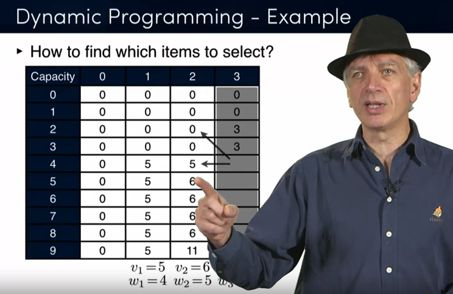
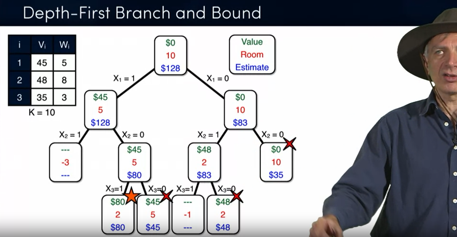
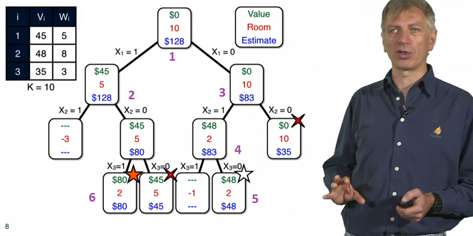
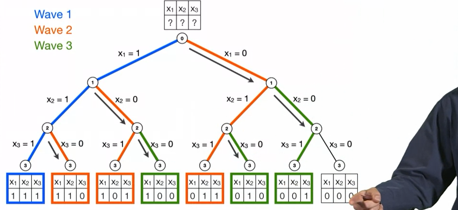

# Discrete Optimization

## Week 1

### Professor Pascal Van Hentenryck
> Pascal Van Hentenryck holds a Vice-Chancellor Strategic Chair in Data-Intensive Computing at the Australian National University and is the leader of the Optimisation Research Group at NICTA. Prior to that, he was professor of computer science at Brown University for more than 20 years and a professor at the University of Melbourne. His main research interests are the design and implementation of optimization systems and their applications to complex problems. His current research projects focus on the use of optimization in logistics and supply chains, energy, and disaster management. He has written five books published by the MIT Press and built several optimization systems that are widely used in academia and industry.
>
>https://www.coursera.org/instructor/~1289035

### Syllabus
> Discrete Optimization is the most important field that no one has heard of. It is the science behind high-efficiency manufacturing, inventory management, energy markets, and sports scheduling, just to name a few. This course provides an introductory overview of to the science of Discrete Optimization and through programming assignments gives you first hand experience of what it is like to solve these types of problems. 
>
> https://www.coursera.org/learn/discrete-optimization/supplement/m0x9h/course-syllabus

#### NP Hardness
> In computational complexity theory, NP-hardness (non-deterministic polynomial-time hardness) is the defining property of a class of problems that are informally "at least as hard as the hardest problems in NP". A simple example of an NP-hard problem is the subset sum problem.
>
>https://en.wikipedia.org/wiki/NP-hardness

#### Van Hentenryck Lecture
>So this, what we're going to talk about in this class are optimization problems, like filling up multi knapsack, or like filling a knapsack. And these problems are called optimization problems, okay? So, these are, as I just said, very, very hard problems. They are among the hardest problems in computer science. And we'll talk about it, and this is a very, very well-defined class, they are called NP complete

> And so, informally, these NP-Complete problems will have two properties. 
> - The first one is very interesting. If I give you a solution, you will be able to verify that this actually indeed a solution very quickly.
> - If you can solve one of these problems okay, one of these NPR problems, then you can solve all of them.
>
>So this is essentially what NP Completeness is about. These two properties, you can check very quickly, and if you can solve one of these hard problems, you can solve all of them.
>
>  We are going to say, you know, finding the best possible solution is this humongous set of possibilities. It's just not possible, and what we're going to do is simply say, okay, we'll find a very, very high quality solution. It's not going to be the best, but it's going to be really close to that.  Okay, so that's the other kind of techniques that we will see in this class, okay?

## Week 2

### Greedy Algorithms
#### Van Hentenryck Lecture - Knapsack 1 - intuition
> First, in the next lecture is talk about greedy algorithm. And what you just saw is essentially, a very simple instance of a greedy algorithm. We take the most valuable item first and then the next valuable item that can fit into a knapsack. But there are many, many possible greedy algorithms.
>
> So, the key idea on all the greedy algorithms is going to be the same. **You're going to pick one item at a time in a greedy fashion.** And the only thing that's going to differ is the meaning of greedy in every one of these algorithms. Okay?
>
> So, in a sense, the main messages today is to show you that in practice there are many different greedy algorithms that you can build. You have to think, you know, creatively. What is the best greedy algorithms that I could get? And some will be better than others in different kinds of instances, okay, so, and, and so you may actually use several of them at the same time. The advantage of this is that they are very easy to use, very easy to design, okay, they can be very, very fast, they give you a first solution, they tell you, okay, you know, now I understand something about this problems. I know that this is at least a baseline, and I have to start doing better than this. They have a lot of issues obviously, okay? So, there is no solution guarantees in general. You don't know much you can improve them, you don't know how good they are. The quality of these heuristics may value from problems to problem, from instances to instances, and so on. And one of the things that I have assumed here is that you can build the solution easily. 

### Knapsack Modeling
> The key for actually solving these problems. You have to be able to model them mathematically why, you know, let me give me an example. You talk with industry, you talk to people, they start describing your problem, and you think you understand it, okay? And then you come back with a beautiful solution and tell you you know you can't do this, that's the constraints. But they didn't express it the right way or they forgot to tell you. And essentially you come up with this beautiful algorithm that really doesn't apply in practice.

#### How to model an optimization problem
> **Choose some decision variables** (Typically encode the result we are intersted in)
>
> **Expres the prblem constrains in terms of these variables** (They specify solutions to the problems)
>
> **Express the object function** (The objective function specififies the quality of each solution)
>
> The result of the aboe three items is an optimization model.  There may be many ways to model and optimization problem.

### Dynamic Programming

Basics (3 Steps)
1) Create a table
2) Fill out the table
3) Trace back to indentify the items

#### Van Hentenryck Lecture
> And dynamic programming is a very widely used technique, okay. So when it works, it works really well and for various classes of problems it works very well. Particular example is computation on biology, a lot of the sequencing problems can be solved using dynamic programming, but sometimes it doesn't work at all and we'll try to give you intuition why okay? And, and, but this is a very useful technique when it works as I said, okay? So the basic principle is, is very simple. It's a divide and conquer approach, okay? You know, you're going to split the problems in different parts. But the really important thing is that it's a bottom-up computation technique, okay? So if you can do that in a top-down divide and conquer, in a top-down or bottom-up technique. Okay, and dynamic programming is about bottom-up.

#### Recurrence Relations 
> In mathematics, a recurrence relation is an equation according to which the {\displaystyle n}nth term of a sequence of numbers is equal to some combination of the previous terms.
> 
> https://en.wikipedia.org/wiki/Recurrence_relation

#### Richard E Bellman
> Richard Ernest Bellman (August 26, 1920 – March 19, 1984) was an American applied mathematician, who introduced dynamic programming in 1953, and made important contributions in other fields of mathematics, such as biomathematics. He founded the leading biomathematical journal Mathematical Biosciences.
>
> A Bellman equation, also known as a dynamic programming equation, is a necessary condition for optimality associated with the mathematical optimization method known as dynamic programming. Almost any problem which can be solved using optimal control theory can also be solved by analyzing the appropriate Bellman equation. The Bellman equation was first applied to engineering control theory and to other topics in applied mathematics, and subsequently became an important tool in economic theory.
>
>https://en.wikipedia.org/wiki/Richard_E._Bellman

### Exhaustive Search - Relexation & branch, and bound

Just Branch and Bound Basics (2 Steps)
- Branch (split into subproblems)
- Bound (find an optimistic estimate)

The problem with the above approach is the chance that you will have to explore too much of the tree.  We can improve it by

Add "relaxation". Before starting the tree
- Sorting the list (in this case max value per weight).
- Lower the optimistic estimate (in this case, take parts of items; make continous).

#### Van Hentenryck Lecture
> And the key idea is that the iterative two steps, okay. Branching and bounding. And branching is boring, right? It's like the exhaustive search, except later on I will tell you that there are smart ways to do this. But at this point it's completely boring. You know, it's like, okay, so I take an item and whether I take the item or not, that's what branching is going to be about, okay. It's like in the exhaustive search. But then bounding. Bounding is very different. It's like finding an optimistic evaluation Of what you can do, okay. So in optimization you have to be optimistic, in life as well right, so we want you to be optimistic. In fact, what is the best that I could ever do, okay, if you are maximizing. Or if you are minimizing, how low can be my cost, okay. So that's the kind of optimistic evaluation that we need for actually for bounding, okay. And I'm going to show you how we can get this.

#### Types of Branch and Bound
##### Depth first (DP)
- Goes Deep
- Prune's once it's found a solution
- Memory is O(n)

##### Best-first (BF)

- Goes for best
- Keeps choosing the best option
- Possibly the entire tree.

###### Limited discrepancy search (LDS)

- Assume a heuristic and go right whenver the hueristic isn't true
- 
- You can implement it effeciently or not...
