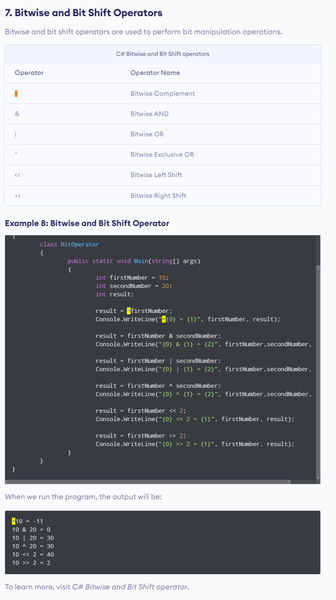

# Notes

## Terms
#### Memoization
> In computing, memoization or memoisation is an optimization technique used primarily to speed up computer programs by storing the results of expensive function calls and returning the cached result when the same inputs occur again.
>
> https://en.wikipedia.org/wiki/Memoization

## Daily
### 2/14 Binary Addition
- Exclusive Operator ^
- Bitwise Operators
